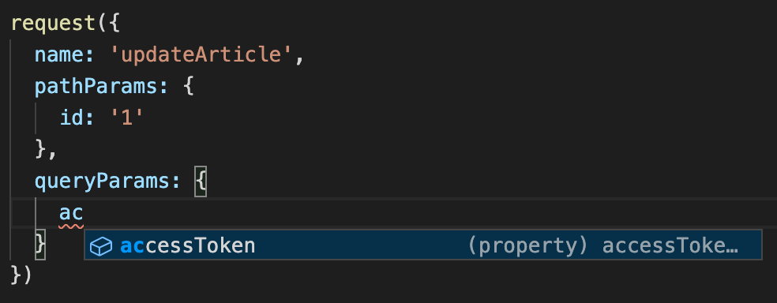

<div align="center">
  <h1>
    TypeScript Request Schema
    <br/>
    <br/>
  </h1>
  <br/>
  <a href="https://www.npmjs.com/package/typescript-request-schema">
    
  </a>
  <br/>
  <br/>
  <br/>
  It's time to type your HTTP requests<br/>
  <br/>
  <br/>
  <pre>npm i <a href="https://www.npmjs.com/package/typescript-request-schema">typescript-request-schema</a></pre>
  <br/>
  <br/>
</div>

* [Motivation](#motivation)
* [Examples](#examples)
* [API](#API)
* [IntelliSense examples](#intellisense-examples)
* [Things to know](#things-to-know)

## Motivation

API request have always the same data type: `url`, `method`, `query params`, `body`, and `response`. This package aim to easily define their types.

Let's take an common request example:

```js
interface Article {}

const article: Article = await fetch(`http://api.com/articles/${id}?accessToken=${token}`, {
  method: 'PATCH',
  body: JSON.stringify({ title: 'new title' })
})
```

**Issues:**

- need to typed the return data on the fly
- no types for path params
- no type for query params
- no type for data

## Examples

Now, imagine a `request` method, fully typed, without need to define type on the fly:

```js
const article = await request({
  name: 'updateArticle',
  pathParams: {
    id: '...'
  },
  queryParams: {
    accessToken: '...'
  },
  data: {
    title: 'new title'
  }
})
```

If you have already work with TypeScript and GraphQL, you know what I am talking about, your API is fully typed thanks to tools like [graphql-code-generator](https://github.com/dotansimha/graphql-code-generator).  

But when you work with a REST API, you haven't always auto generated TS interfaces.

### Schema

Let's go to define our schema:

```ts
export const schema = {
  updateArticle: {
    url: (pathParams: { id: string; }) => `articles/${pathParams.id}`,
    method: 'PATCH',
    queryParams: {} as {
      accessToken: string;
    },
    data: {} as {
      title?: string;
      content?: string;
    },
    response: {} as {
      id: string;
      title: string;
      content: string;
      updatedAt: string;
    }
  }
}
```

This object schema will be used as plain JavaScript object and TypeScript definition, thanks to `as` keyword.

`queryParams`, `data` and `response` are only use as TypeScript type.

### Request

Now, let's build our request function:

```js
import { AxiosRequestConfig, AxiosPromise } from 'axios'
import { Config, Response } from 'typescript-request-schema'
import { schema } from './schema'

type Schema = typeof schema
type RequestName = keyof Schema
type ExtraConfig = AxiosRequestConfig
type RequestConfig<T extends RequestName> = Config<T, Schema, ExtraConfig>
type RequestResponse<T extends RequestName> = AxiosPromise<Response<T, Schema>>

function request<T extends RequestName>(config: RequestConfig<T>): RequestResponse<T> {
  const { name, pathParams, queryParams, data, ...restConfig } = config
  const { url, method } = apiSchema[name]
  const urlWithPathParams = (typeof url === 'function' && pathParams)
    ? url(pathParams)
    : url as string

  return axios.request({
    url: urlWithPathParams,
    method,
    data,
    params: queryParams,
    ...restConfig
  })
}
```

Now, your `request` function is fully typed !

```js
const article = await request({
  name: 'updateArticle',
  pathParams: {
    id: '...'
  },
  queryParams: {
    accessToken: '...'
  },
  data: {
    title: 'new title'
  }
})
```

## API

* `Config<RequestName, Schema, ExtraConfig>`
* `Response<RequestName, Schema>`
* `validateSchema()` - use for TS check

## IntelliSense examples

*Note*: on the following screen shots, request names are not the same than the previous examples. You can use any name format for your resquest name.

* `name`  


* `data`  


* `queryParams`  


* `response`  


* `othersProperties`  


## Things to know

### Schema keys names

Each keys of the `schema` object can be named like you want. In examples, names are `GET users`, `GET users/:id`, but you can named it `GET_users`, `users get`, `retrieve users`, `update users/id`, etc. Keys are use by TypeScript to find the correct route schema, so it's completely arbitrary. TypeScript will autocomplete keys for you, so even with a complicated format like `GET users/:id`, you don't have to remember it.
