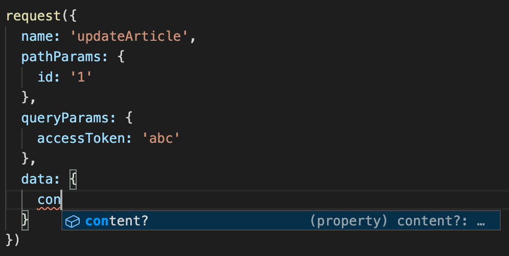

<div align="center">
  <h1>
    Axios TypeScript Schema
    <br/>
    <br/>
  </h1>
    <br/>
    <a href="https://www.npmjs.com/package/axios-ts-schema">
      
    </a>
    <br/>
    <br/>
    <br/>
    Axios schema for TypeScript Intellisense
    <br/>
  <br/>
  <br/>
  <pre>npm i <a href="https://www.npmjs.com/package/react-resources-store">axios-ts-schema</a></pre>
  <br/>
  <br/>
</div>

* [Example](#example)
* [TypeScript IntelliSense](#typeScript-intellisense)
* [Things to know](#things-to-know)
* :warning: [Axios compatibility version](#warning-axios-compatibility-version)
* [Under the hood](#under-the-hood)

Axios TS Schema make possible to define your schema in one place and then use `axios.request()` without the need to type output for each request. It also add new types like `urlParams`, `params` and `data`.

`schema` object is a mix of plain JavaScript and TypeScript definition. That is possible with the powerful `as` keyword.

## Example

```js
import { createAxiosTSInstance } from 'axios-ts-schema'

const schema = {
  'GET users': {
    url: 'users',
    method: 'GET',
    params: {} as {
      page?: number,
      pageSize?: number,
    },
    data: null,
    response: {} as {
      id: string,
      username: string,
      email: string
    }[]
  },
  'PATCH users/:id': {
    url: (params: { id: string }) => `users/${params.id}`,
    method: 'PATCH',
    params: null,
    data: {} as {
      username?: string,
      email?: string
    },
    response: {} as {
      id: string,
      username: string,
      email: string
    }
  },
}

const api = createAxiosTSInstance({ baseURL: '...' }, schema)

// GET
const user = await api.request({
  routeName: 'GET users',
  params: {
    page: 1,
    pageSize: 10
  },
})

// PATCH
const user = await api.request({
  routeName: 'PATCH users/:id',
  urlParams: {
    id: '1'
  },
  data: {
    username: 'John Doe'
  }
})
```

Properties `url` and `method` are used as JavaScript value


Properties `params`, `data`, `response` and `url(params)` are used as TypeScript definition.

## TypeScript IntelliSense

* `routeName`  


* `data`  


* `params`  


* `urlParams`  


* `response`  


## Things to know

### Required and omited request properties
`axios-ts-schema` required 2 new properties on axios request config and omit 2 others.

It require:
  * `routeName` - use to get route config and definition
  * `urlParams` - object with params for url

It omit:
  * `url`
  * `method`

Theses 2 keys are already define in the schema

### Schema keys names

Each keys of the `schema` object can be named like you want. In examples, names are `GET users`, `GET users/:id`, but you can named it `GET_users`, `users get`, `retrieve users`, `update users/id`, etc. Keys are use by TypeScript to find the correct route schema, so it's completely arbitrary

## `url`, `urlParams` and `method`

Theses properties are handled by an [axios interceptor](src/addAxiosTsInterceptor.ts) in order to convert schema route to plain axios config.

## :warning: Axios compatibility version

Not compatible with `axios@0.19.x` due to breaking changes with custom config, see [axios/issues/1718](https://github.com/axios/axios/issues/1718).   

Use axios `axios@0.18.x` instead

## Under the hood

`createAxiosTSInstance()` do 3 things:
* create Axios instance
* add interceptor
* type output

```js
export function createAxiosTSInstance<T, Instance = AxiosTSInstance<keyof T, T>>(
  axiosConfig: AxiosRequestConfig, schema: T
): Instance {

  const api: Instance = axios.create(axiosConfig)

  addAxiosTsInterceptor(api, schema)

  return api;
}
```